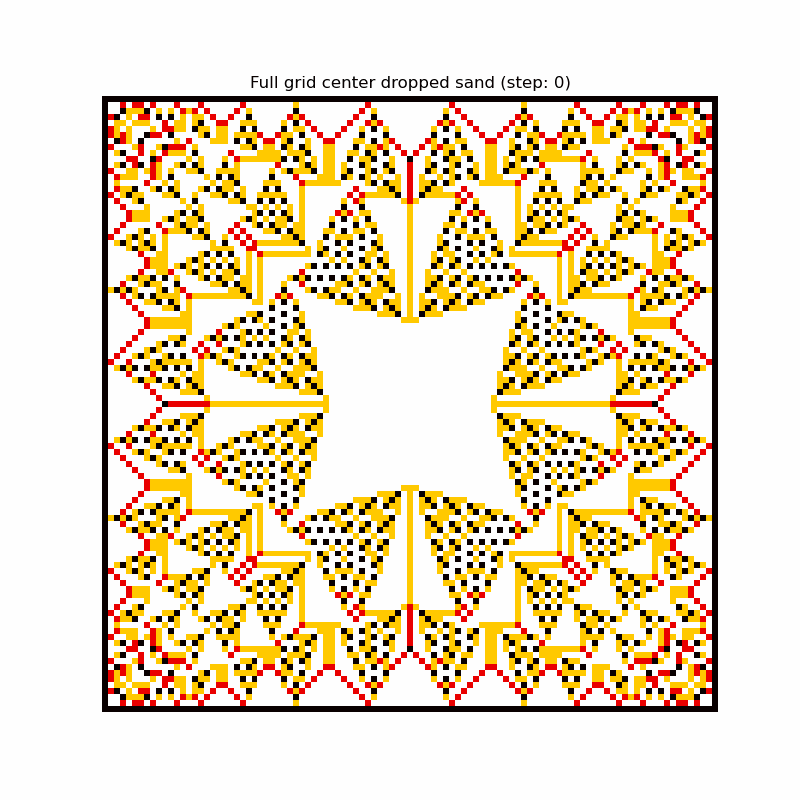
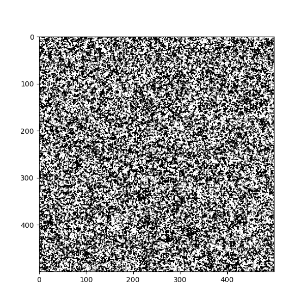
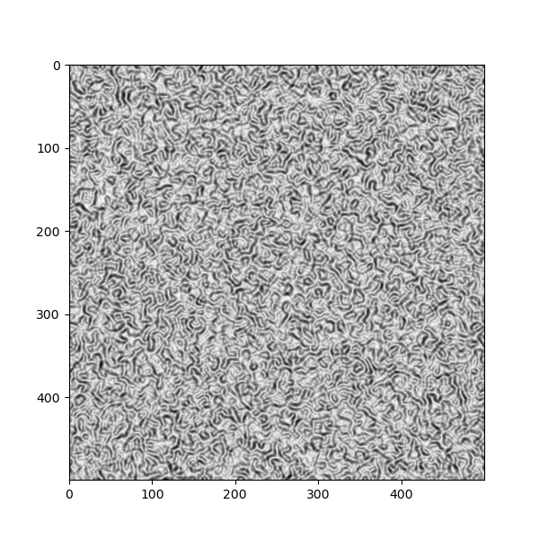
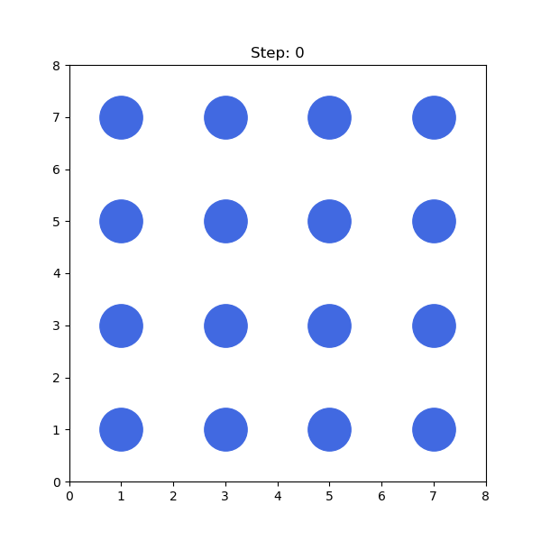
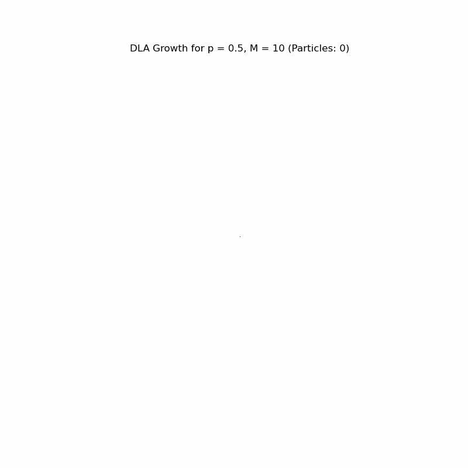

# Computational Physics Simulations

A curated collection of numerical methods, deterministic simulations, and stochastic models developed during my coursework. 

### 🛠️ Tech Stack & Tools
* **Language:** Python
* **Libraries:** NumPy, SciPy, Matplotlib (Pyplot & FuncAnimation), ImageIO
* **Optimization:** Numba (`@jit` compilation for high-performance Monte Carlo steps)
* **Environment:** Jupyter Notebooks (`.ipynb`)

---

## 📊 Visual Gallery

The following animations illustrate emergent behavior and physical transitions across different modules.

| Sandpile SOC | Wa-Tor Predator-Prey |
| :---: | :---: |
|  |  |
| *Avalanches in a critical state.* | *Agent-based population dynamics.* |

| Ising Model: Domain Growth | Ising Model: Periodic Borders |
| :---: | :---: |
|  |  |
| *Metropolis algorithm domain formation.* | *Phase separation and boundary evolution.* |

| Thermodynamics: Liquid State | Thermodynamics: Solid State |
| :---: | :---: |
|  |  |
| *Isokinetic thermostat (Fluid).* | *Lattice stability under temperature control.* |

| Fractal Growth (DLA) | N-Body Orbital Mechanics |
| :---: | :---: |
|  |  |
| *Diffusion-Limited Aggregation.* | *Stable Chenciner 3-body orbit.* |

---

## 🔬 Core Modules & Simulations

### 1. Complex Systems & Emergent Behavior
* **Agent-Based Modeling ([13_wator_predator_prey_model.ipynb](./src/13_wator_predator_prey_model.ipynb)):** OOP implementation of the Wa-Tor world, simulating shark/fish population oscillations.
* **Self-Organized Criticality ([12_bak_tang_wiesenfeld_sandpile.ipynb](./src/12_bak_tang_wiesenfeld_sandpile.ipynb)):** BTW sandpile model used to analyze power-law distributions of avalanches.
* **Diffusion-Limited Aggregation ([10_dla_growth_simulation.ipynb](./src/10_dla_growth_simulation.ipynb)):** Fractal growth simulation driven by brownian motion and adherence probabilities.
* **Reaction-Diffusion ([11_gray_scott_reaction_diffusion.ipynb](./src/11_gray_scott_reaction_diffusion.ipynb)):** Solving coupled PDEs to observe Turing pattern formation.

### 2. Molecular Dynamics & Thermodynamics
* **Lennard-Jones Gas ([05_lennard_jones_molecular_dynamics.ipynb](./src/05_lennard_jones_molecular_dynamics.ipynb)):** Modeling particle interactions and force calculations with periodic boundaries.
* **Isokinetic Thermostat ([06_isokinetic_thermostat.ipynb](./src/06_isokinetic_thermostat.ipynb)):** Velocity rescaling and energy conservation in NVT-like ensembles.

### 3. Stochastic Models & Monte Carlo Methods
* **Ising Model ([08_ising_model_metropolis.ipynb](./src/08_ising_model_metropolis.ipynb)):** High-performance simulation of magnetic phase transitions using Numba-optimized Metropolis steps.
* **Domain Growth Kinetics ([09_domain_growth_kinetics.ipynb](./src/09_domain_growth_kinetics.ipynb)):** Comparative study of Metropolis vs. Kawabata dynamics and their respective scaling laws.

### 4. Chaos Theory & Orbital Mechanics
* **Duffing Oscillator ([02_chaos_duffing.ipynb](./src/02_chaos_duffing.ipynb)):** Analysis of non-linear differential equations and mapping chaotic attractors. Includes an interactive UI script ([02_chaos_duffing.py](./src/02_chaos_duffing.py)) built with `matplotlib.widgets`.
* **N-Body Problem ([04_nbody_orbital_mechanics.ipynb](./src/04_nbody_orbital_mechanics.ipynb)):** High-precision numerical integration of gravitational systems, focusing on the stable Chenciner "figure-eight" orbit.

### 5. Fractals & Network Theory
* **Fractal Dimensions ([03_fractals.ipynb](./src/03_fractals.ipynb)):** Automated calculation of fractal dimensions for Sierpinski and Barnsley structures using box-counting algorithms and `scipy.optimize`.
* **Percolation Phase Transitions ([07_percolation_phase_transitions.ipynb](./src/07_percolation_phase_transitions.ipynb)):** Identification of critical thresholds in random networks using Breadth-First Search (BFS) clustering logic.

---

## 🚀 How to Run

Clone the repository and install the required dependencies:

```bash
git clone [https://github.com/Ghost1459/Computational-Physics-Simulations.git](https://github.com/Ghost1459/Computational-Physics-Simulations.git)
cd Computational-Physics-Simulations
pip install numpy scipy matplotlib numba imageio jupyter
jupyter notebook
